# Unsere Reise nach Den Haag

### ICE nach Utrecht

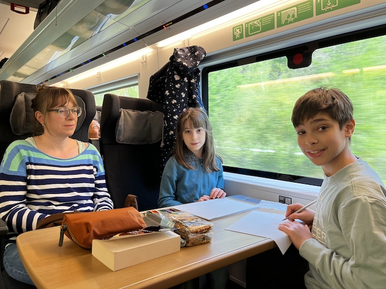

Gegenüber den Kindern vom Tisch  nebenan haben Kiran und Sushmita sich vorbildlich verhalten:) Malen und lessen, und nur ein bisschen langweilen;) Die beiden fanden es aber super toll.

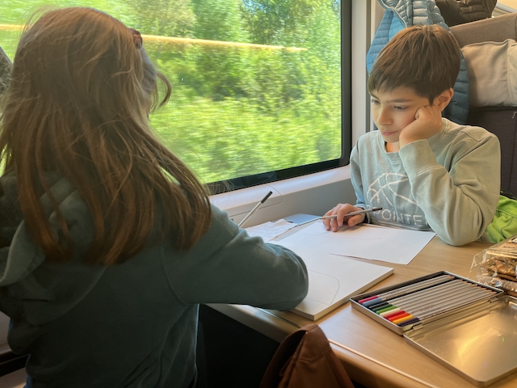

## In der Wohnung 

Kiran bestätigt!!

Hell und groß sind die Zimmer. Insbesondere das Esszimmer.

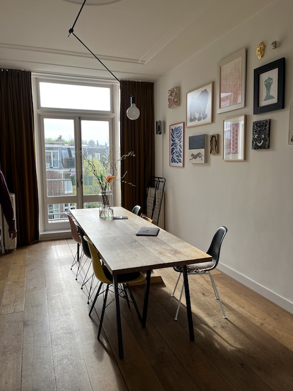

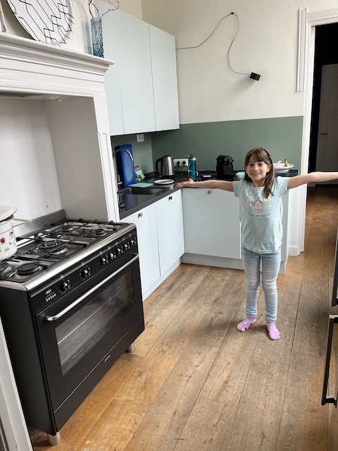

Wir wohnen im ersten Obergeschoss, aber die ganze Wohnung legt ein Stockwerk höher. Verrückt;)

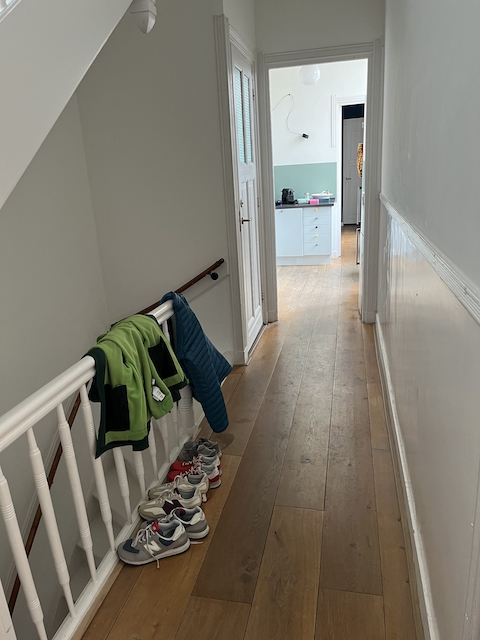

## Ein Spaziergang am Strand

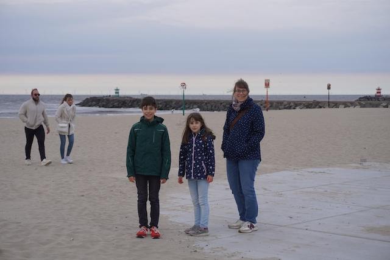

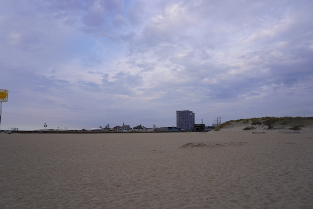

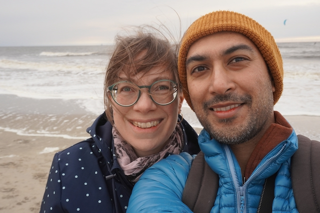

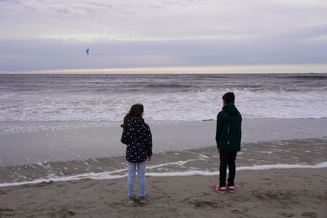

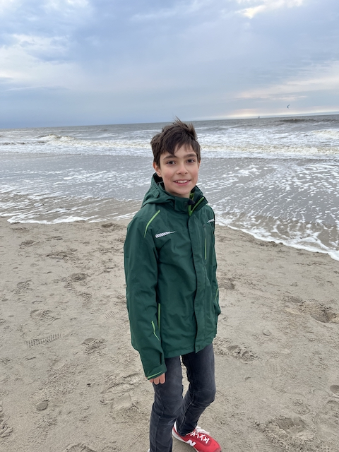

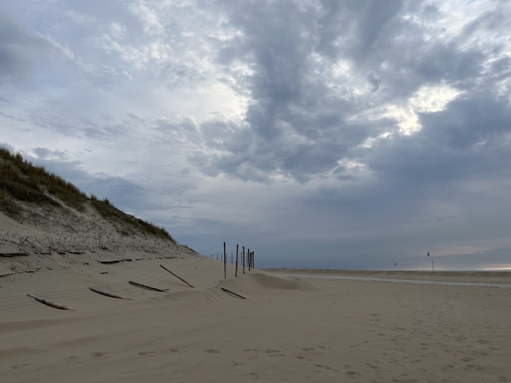

Als die Sonne ging unter, haben wir den Strand verlassen. Wir müssten Lebensmittel einkaufen. Unterwegs nach unserer Ferienwohnung hatten wir bei *Jumbo* angehalten, und wurden mit unsere Lieblings Erdnussbutter wiedervereint.

 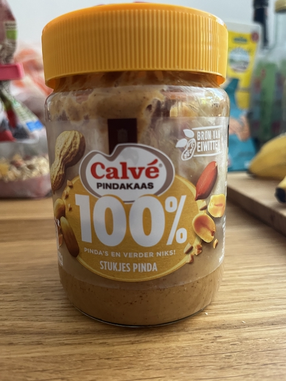