## Mit dem Rad durch Den Haag und die Dünen

Wir hatten den Tag langsam angefangen. Mit viel vor uns, hatten wir ein gutes Frühstück gemacht. Papa hatte ein Omelette mit vielen Eiern gekocht.

|  | 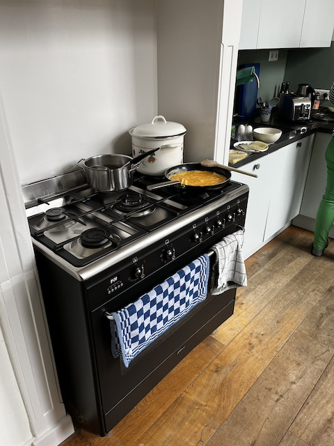 |
| ------------------------------------- | ----------------------------------- |

Nach dem Frühstück hatten wir unser Leihräder abgeholt von [Haagse Stadsfiets](https://www.haagschestadsfiets.nl/de/). Denn der Laden an der oberen Ende der Stadt liegt, hatten wir teils der Strecke mit der Bahn zurückgelegt.

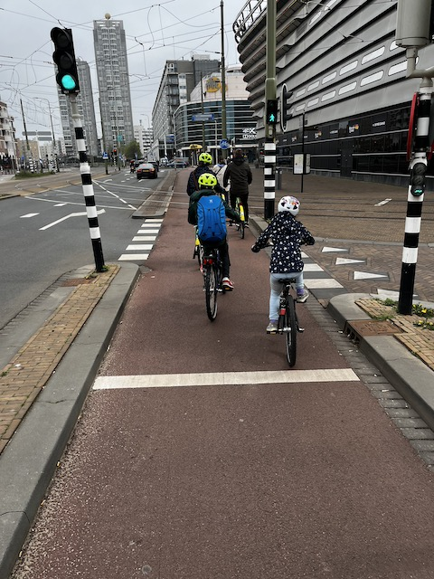

Die Radinfrastruktur in den Haag, und vermutlich in den ganzen Niederlanden, ist ein Traum. Nach dem abholen sind wir zum [de Pier](https://denhaag.com/de/de-pier) gegangen. Die Halbbrücke ist ein Wahrzeichen der Stadt. Am Ende der Pier ist ein Riesenrad.

​	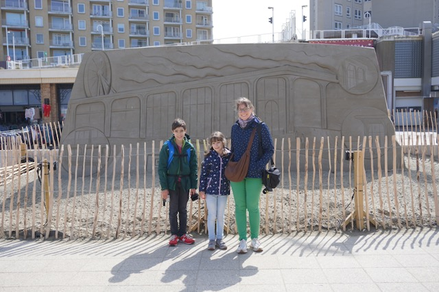

| 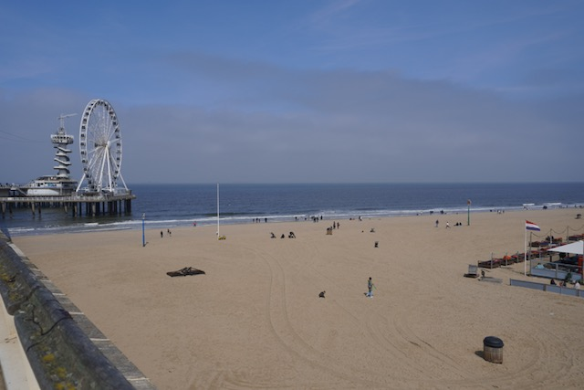 | 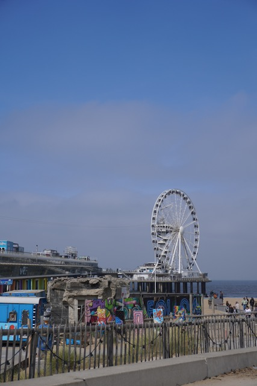 |
| --------------------------------------------- | -------------------------------------- |
| 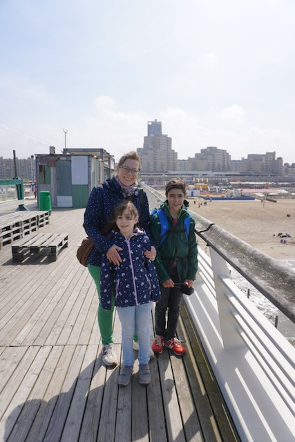 | 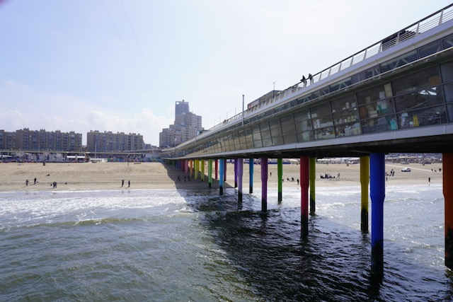        |

### Die Spannung

| 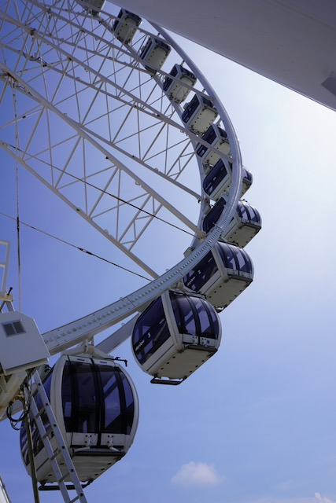 | 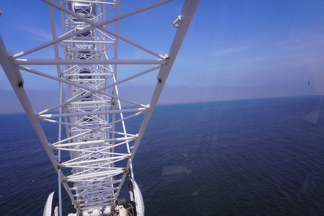 |
| -------------------------------------- | -------------------------------------- |

### ... und die Erleichterung

| 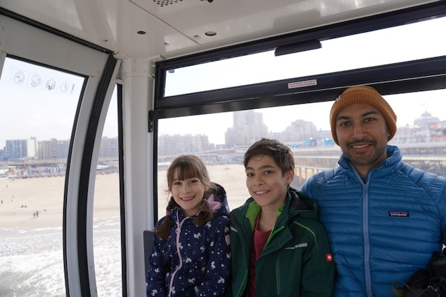 | 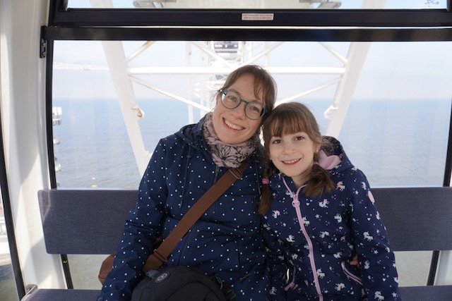 |
| -------------------------------------------- | -------------------------------------------- |

Von oben gab es herrliche Blicke über das Meer und den Strand.

| 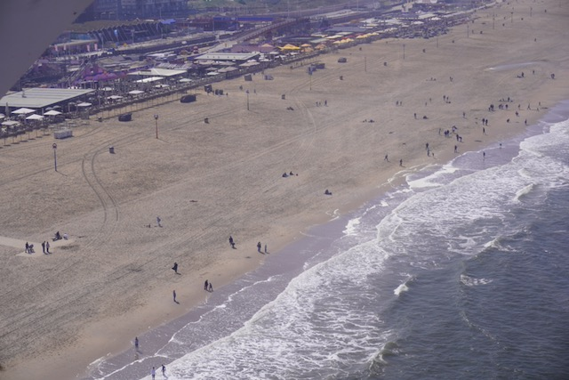 | 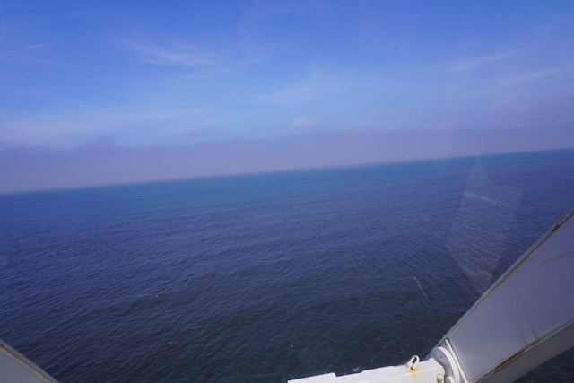 |
| --------------------------------------- | --------------------------------------- |

### Mittagessen

Nachdem aufregende Riesenrad fahrt hatten wir bei dem Food Court am touristischen Strand angehalten. Es gab viele leckere Gerichte. Wir hatten von unterschiedlichen Restaurants bestellt. Papa und Mama hatten Sri Lankanische Essen geholt, und die Kinder hatten einen Gyros Teller geteilt.

| 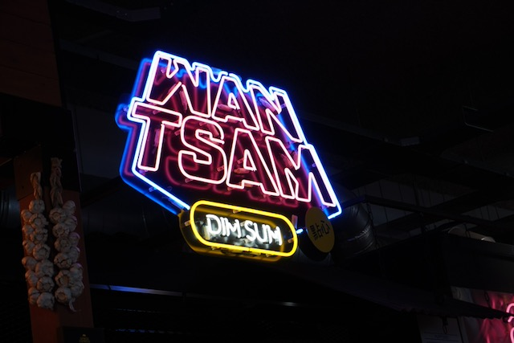 | 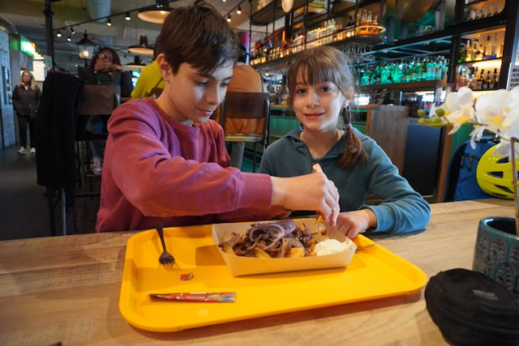 |
| ------------------------------------- | ---------------------------------------- |

### Nationalpark Holländische Dünen

Wir hatten den Nationalpark von der südlicher Seite eingetreten. Also von Scheveningen. Der Weg durch den Dünengebiet ist ziemlich breit, gut ausgelegt, und angenehm zu fahren.

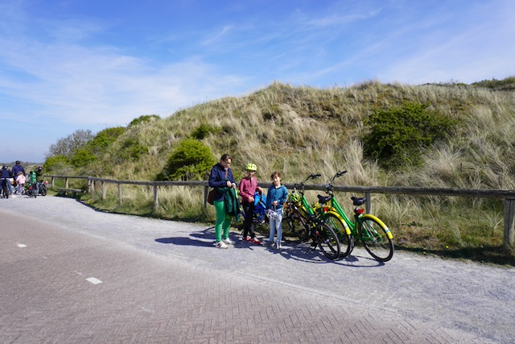

| 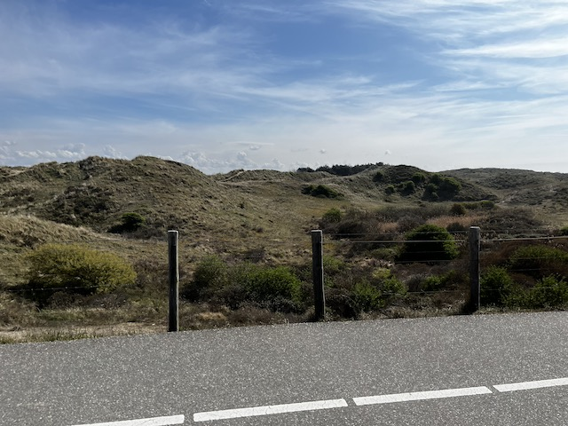 | 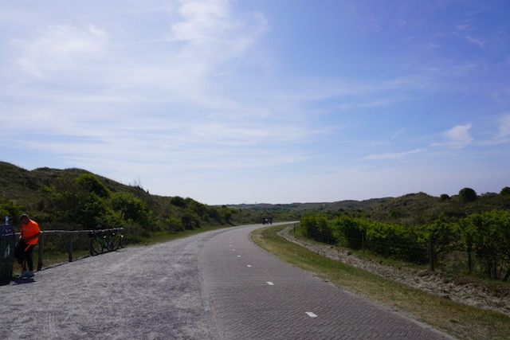 |
| ------------------------------------ | --------------------------------------- |

Zwischendurch hatten wir angehalten um einen überblick der Dünen zuhaben. Wie toll ist es Dünen und Strand in Stadtnähe zu haben.

| 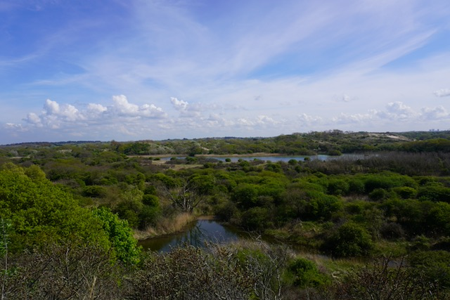                 | 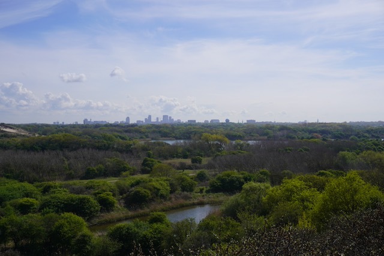             |
| ------------------------------------------------- | --------------------------------------------- |
| 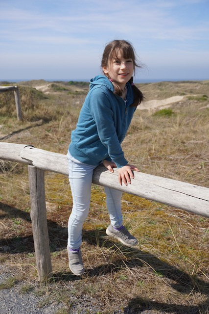 | 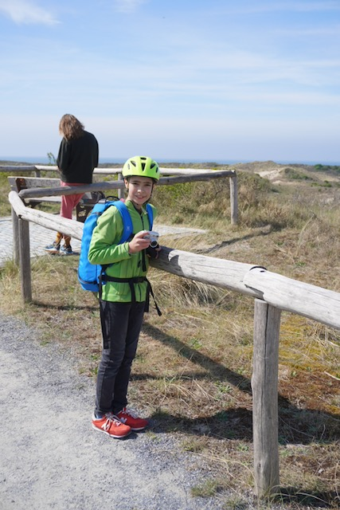 |

### Strand Wassenaarseslag

Weiter Richtung Norden hatten wir einen Strandabschnitt entdeckt. 

| 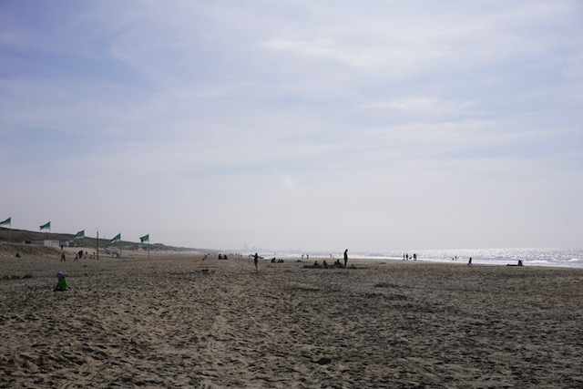 | 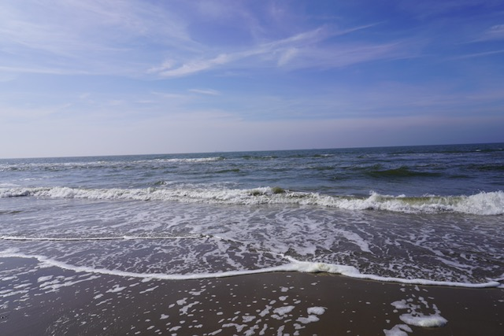 |
| ----------------------------------- | ----------------------------------- |

Die Musselsucherei am Strand.

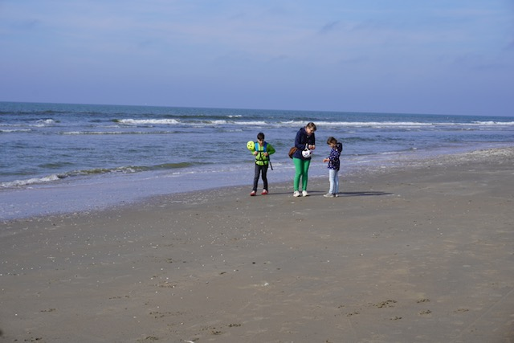

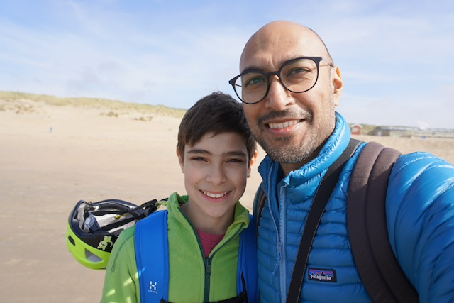

Auf der Rückweg ein Selfie von uns.

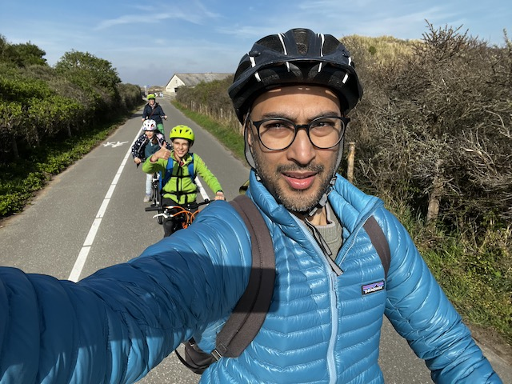

Zurück in der Ferienwohnung, hatten wir eine spätere Kaffeezeit gemacht. Bei Kiran und Sushmita ist Kaffeezeit Pflicht;)

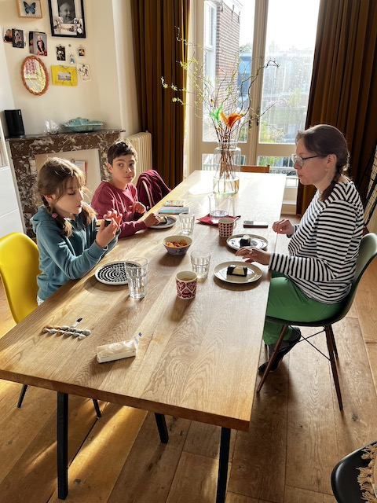

