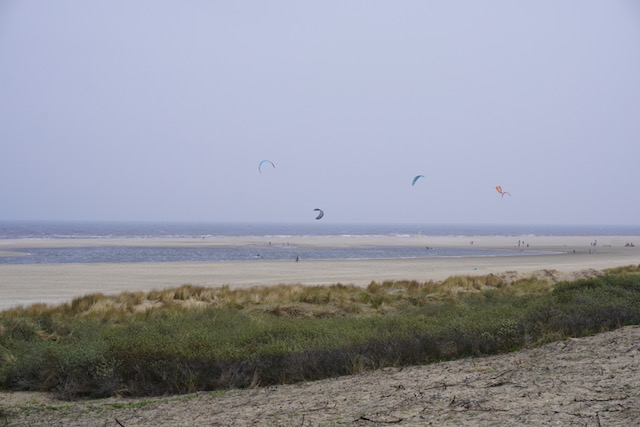

Am Donnerstag waren wir an einem Strand namens Monster Beach. Zum Strand sind wir geradelt. Dort sind wir rumgelaufen und haben ein paar Fotos gemacht.

Wie man auf den Bildern sieht war es an diesem Tag nicht so sonnig. Es war zwar auch recht windig, aber trotzdem schön.

Auf dem Rückweg  vom Monster Beach kamen wir im Westdünenpark an einem Acker vorbei auf dem Schottische Hochland Rindern standen. (Die in diesem Fall wohl eher Niederländische Flachland Rinder waren. Aber die gibt es nicht.)

Eins stand da und besah sich das Fotoknipsen.

Nach einer kurzen Pause sind wir in die Stadt geradelt und haben uns den Friedenspalast und die Haagsche Tore angesehen. Hier ein Bild vom Friedenspalast.

Danach sind wir zu den de Haagsche Tore gegangen. Hier ein Bild von innen. (Die Haagschen Toore ist eine Kirche.) 

##### 

Es waren viele Treppenstufen bis zu den Glocken. Aber man wurde mit einem fantastischen Blick über die Stadt belohnt.

