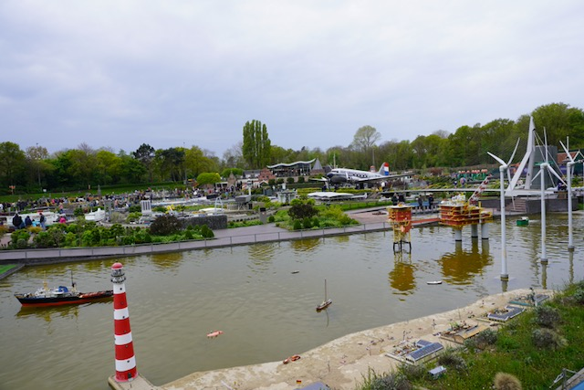
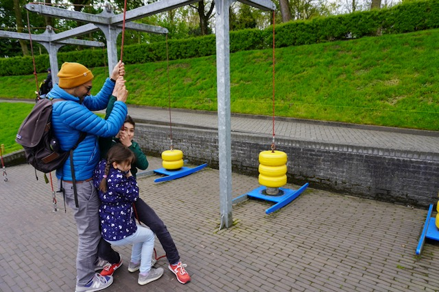
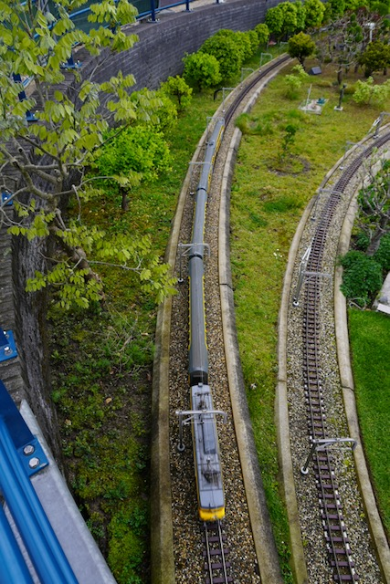
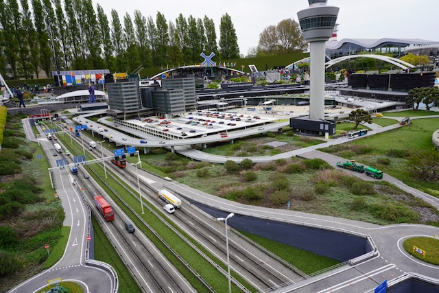
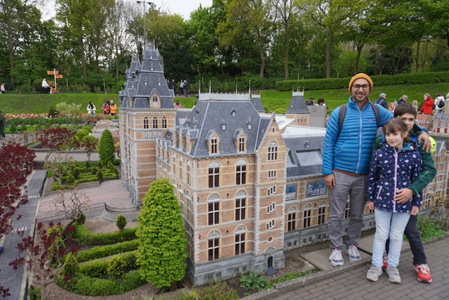
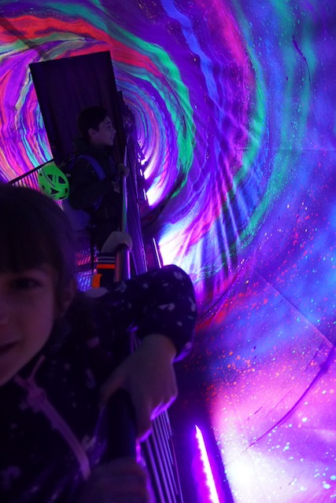
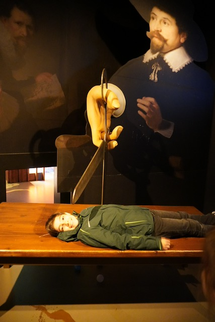
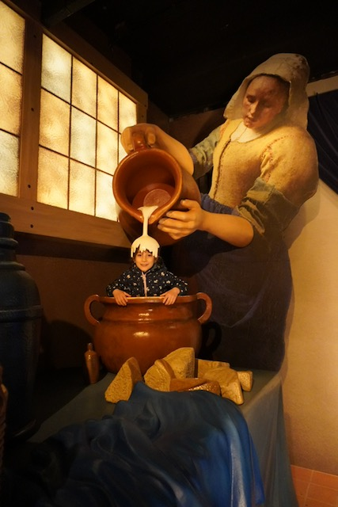
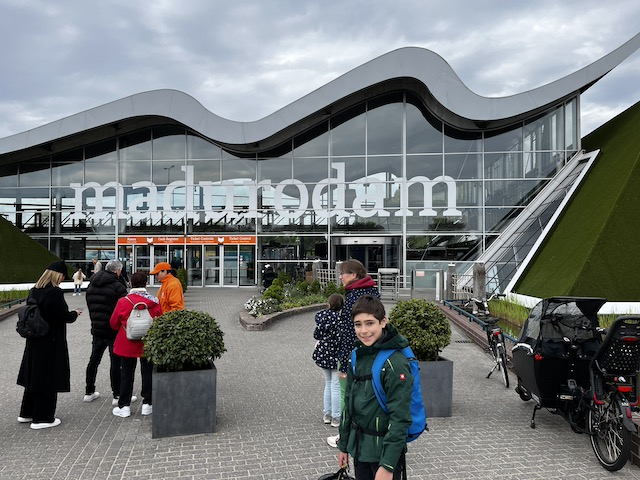
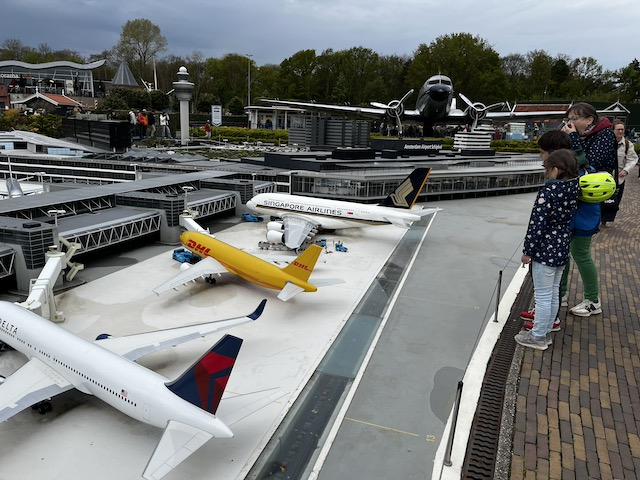

## Madurodam

Am Mittwoch wir sind zu Madurodam geradelt, auf tollen Radwegen. Es war Kühler als am Dienstag und Wolkiger. 

Auf dem ersten Bild sieht man einen See oder Fluss. Wo man die Windräder so drehen Konnte, dass perfekt im Wind standen

Auf dem zweiten Bild sieht man eine von ein paar coolen dingen die man indem Park machen kann. Bei dieser station kann man verschieden viele Käseleibe hoch heben.

Auf dem Rückweg sind wir im regen sehr nass geworden.

