Wir haben den Osternmontag langsam angefangen mit Frühstuck. Da Osternmontag auch ein Nationalfeiertag in den Niederlanden ist, konnten wir unsere Fahrräder nicht abholen (das war sowieso für Dienstag geplant). Zum Glück war das M.C. Escher Museum geöffnet. 

Unterwegs hatten wir die zwei verarsche Möwen begegnet alles wir zum M.C. Escher Museum liefen.

## M.C. Escher Museum

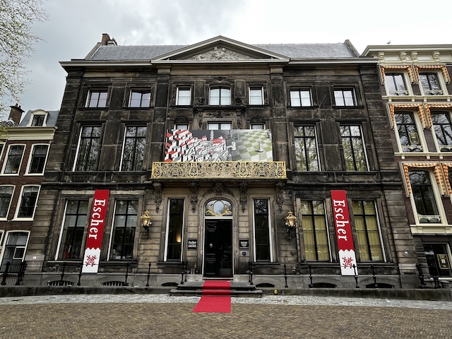

Zwei herrliche Drucke. Den zweiten, links, haben wir als Nachdruck gekauft.

| 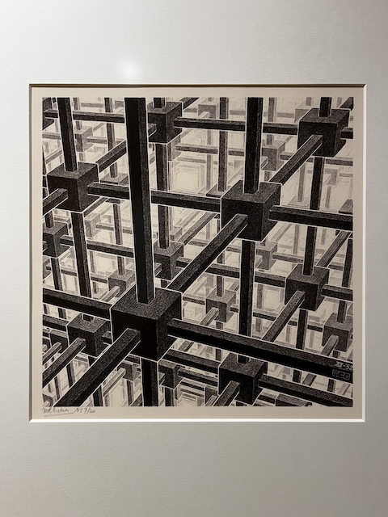 | 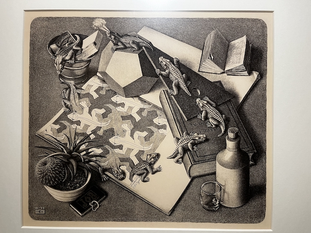 |
| --------------------------------------------- | --------------------------------------------- |

Am obersten Stock konnte man sein einiges Muster erstellen.

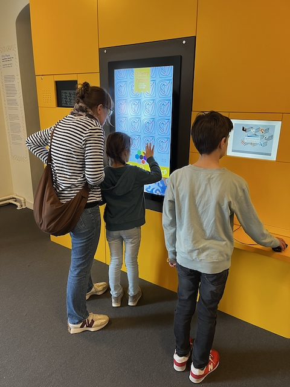

Nach dem Museum besuch hatten wir eine kurze Pause gemacht. Fast nebenan gab es einen Markt mit vielen Verkaufsständen. Unter den gab es verschiedene Speisewägen.  Wir hatten uns Pommes und *Kaas Soufflee* , also frittiert und panierte Käse, geholt. Lecker  😋

Danach sind wir in Richtung Binnenhof, wo die Regierung sitzt.  

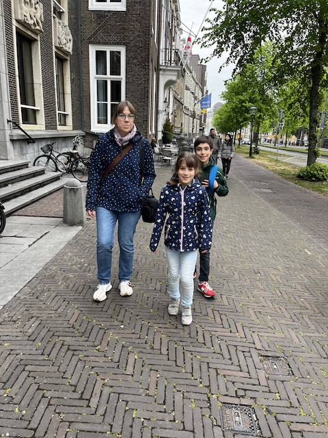

Binnenhof ist im Bau zurzeit und man kann ihn nicht besuchen. Die Stadt oder wer auch immer hat einen Turm erreichet um die Baustelle. Von oben konnte man im Binnenhof blicken. Im Hintergrund ist die Skyline Den Haag zu sehen. In der gegen Richtung ragt der [**Haager Turm**](https://denhaag.com/de/der-haager-turm) auf. Das Wahrzeichen der Stadt werden wir am Donnerstag hochklettern und das Uhrwerk und die zwei Glocken ansehen.

| 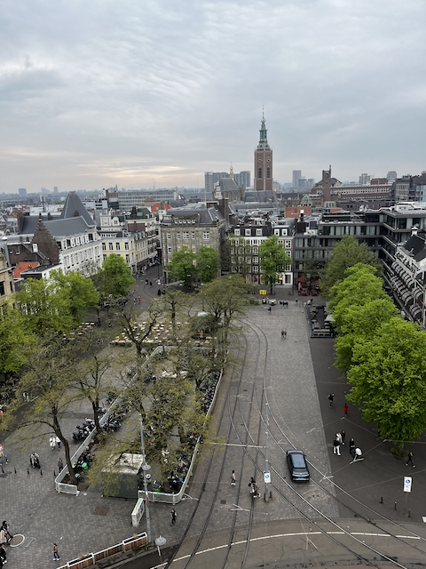 | 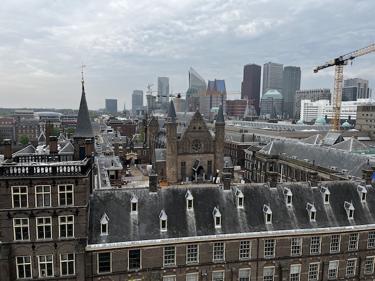 |
| ------------------------------------------------------------ | ---------------------------------------------- |

Das *Centrum* (Stadtzentrum) ist hip, hipster, und ist von Cafés und Einzelläden und Ateliers geprägt.     

| 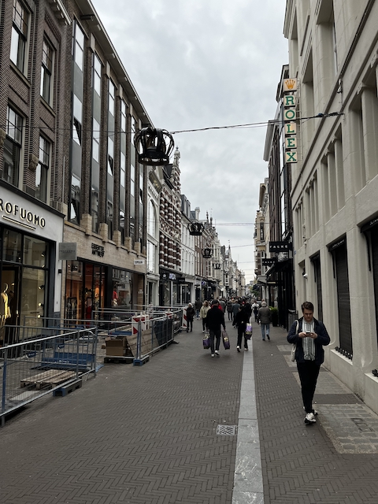 | 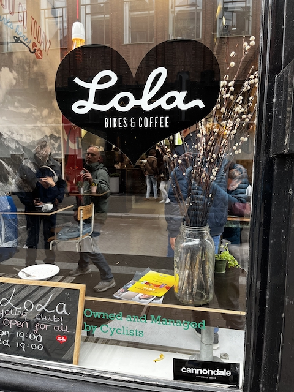 |
| :----------------------------------------------------------- | ------------------------------------------------------------ |

## Nochmal am Strand

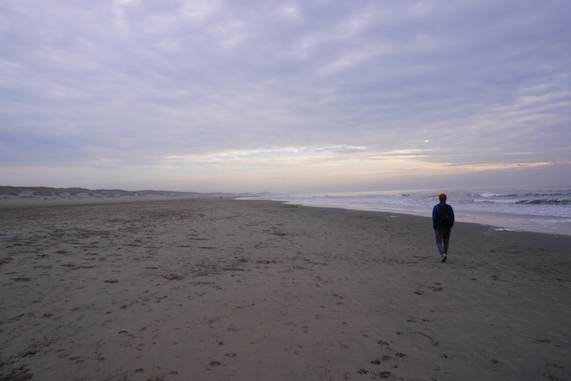

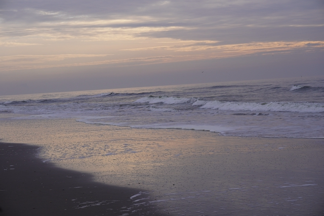

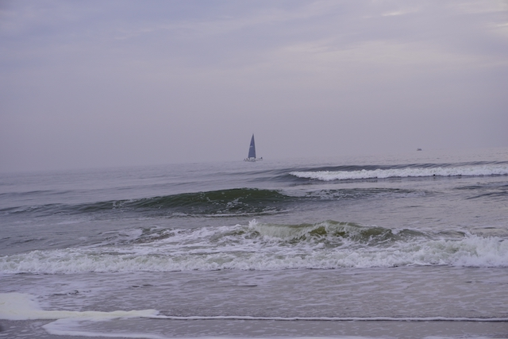

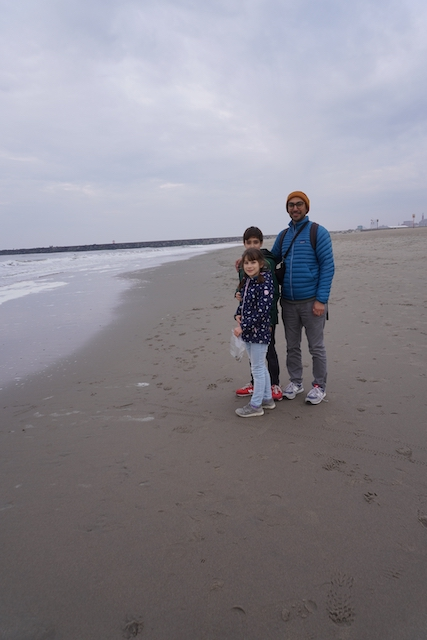

Aus Neugier hatten wir die nächste Halbbrücke erkundet. Am ende der Halbbrücke ist ein grüner Leuchtrum, und vor dem hatten wir obligatorische Fotos gemacht. Je näher am Leuchtturm desto windiger    es war. 

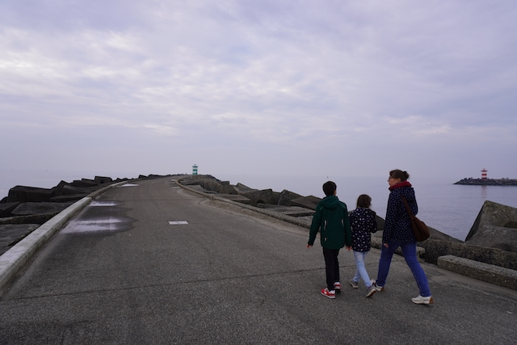

 Quatsch machen vor der Kamera;)

| 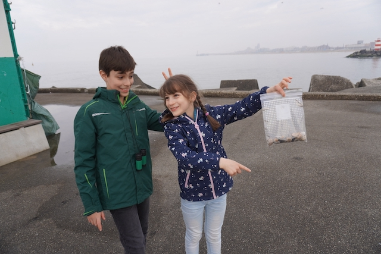 | 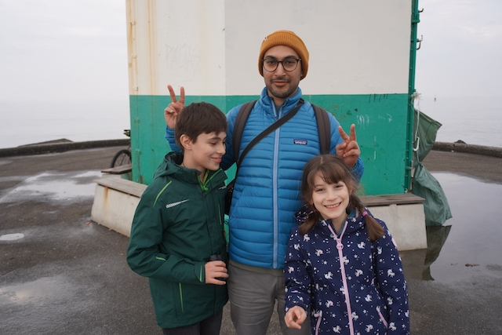 |
| :---------------------------------------------- | ------------------------------------------------------------ |

Endlich ein gescheites Foto;)

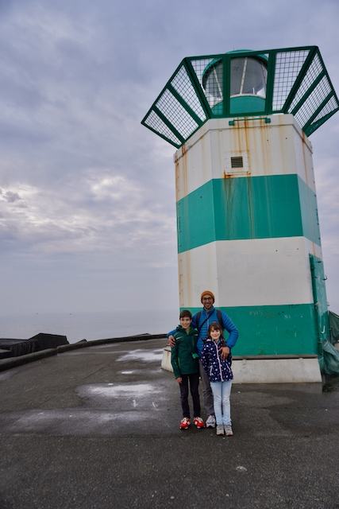

Nach dem Strandbesuch sind wir nach heim gelaufen. Unterwegs mussten wir was beim Jumbo fürs Abendessen kaufen. *Liebe Jumbo als Albert Heijin.*

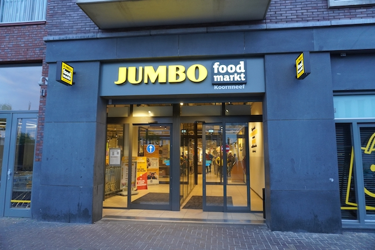